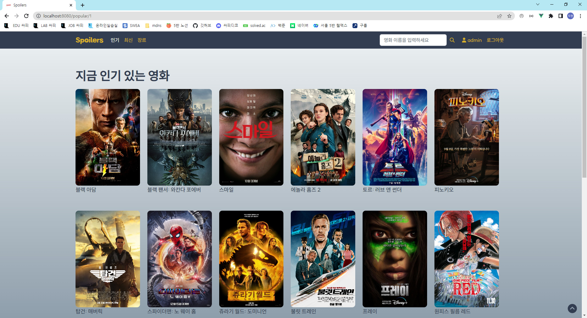

# FINAL PJT


## 프로젝트 목표

- 영화 데이터 기반 추천 서비스 구성
- 영화 추천 알고리즘 구성
- 커뮤니티 서비스 구성
- 서비스 관리 및 유지보수


## 사용 아키텍처

- Django REST Framework
- Vue


## 개요

### Spoilers


리뷰 및 트레일러와 같은 영상을 중심으로 영화에 대한 정보를 보여주는 홈페이지입니다.

### URL


| url                                 | view 함수      | 기능                 | 내용                                         |
| ----------------------------------- | -------------- | -------------------- | -------------------------------------------- |
| /admin/                             |                | 어드민               | 어드민 페이지                                |
| /movies/                            | movie_list     | 전체 영화 api        | 전체 영화 데이터 API                         |
| /movie/<movie_pk>/                  | movie_detail   | 개별 영화 api        | 세부적인 영화 정보 및 리뷰 영상 조회         |
| /movie/<movie_pk>/reviews/          | review_vid     | 리뷰 데이터 추가     | 영화에 해당하는 리뷰 비디오 링크 데이터 추가 |
| /movie/genres/                      | genre_list     | 전체 장르 api        | 전체 장르 데이터 API                         |
| /api/accounts/                      | user_detail    | user api             | 유저 정보 api로 출력                         |
| /accounts/login/                    |                | 로그인               | 로그인 정보를 받아 토큰 발행                 |
| /accounts/signup/                   |                | 회원가입             | 회원가입정보를 받아 가입후 토큰 발행         |
| /api/community/<movie_pk>/          | comment_update | 영화 댓글 삭제       | 댓글 삭제                                    |
| /api/community/<movie_pk>/comments/ | create_comment | 영화 댓글 달기       | 개별 영화에 대한 텍스트 생성                 |
| /api/community/<movie_pk>/wish/     | wish           | 위시리스트 추가/제거 | 영화를 위시리스트에 추가하거나 제거하기      |

| url                       | 기능                | 내용                                         |
| ------------------------- | ------------------- | -------------------------------------------- |
| /                         | 홈                  | 입장 페이지                                  |
| /popular/:page            | 최신 영화 조회      | 개봉일자 순으로 정렬된 전체 영화 데이터 조회 |
| /new/:page                | 배우 정보 조회      | 개별 영화 페이지 출력                        |
| /genre                    | 장르 리스트 조회    | 전체 장르 리스트 출력                        |
| /genre/:genre/:code/:page | 장르별 영화 조회    | 개별 장르에 해당하는 영화 리스트 출력        |
| /profile/:username/:page  | 프로필 조회         | 개별 유저 프로필 출력                        |
| /moviedetail/:id          | 개별 영화 조회      | 개별 영화 정보 출력                          |
| /actor/:name/:id/:page    | 배우 출연 영화 조회 | 배우별로 출연한 영화 리스트 출력             |
| /signup                   | 회원가입            | 회원가입 정보 입력받는 페이지                |
| /login                    | 로그인              | 로그인 정보 입력받는 페이지                  |
| /search/:keyword/:page    | 검색                | 검색 결과 페이지 출력                        |


### ERD


### 컴포넌트 트리


## 영화 데이터




### 결과

`.js`

```javascript

```


### 핵심 포인트

- `axios`를 통해 api 데이터를 추출해야 합니다.
- 이때 api사이트가 요구하는 파라미터에 맞춰서 입력해야 합니다.


## 후기

Javascript와 css의 기억이 돌아오고 있습니다.

vue도 django와는 다른 재미가 있습니다.